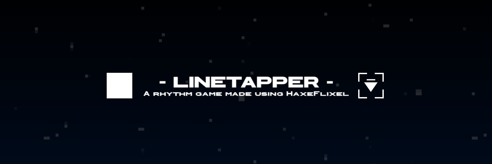

  

  
  
  
  

  <b>
    A rhythm game made by CoreCat using <a href='https://haxeflixel.com/'>HaxeFlixel</a>.
  </b>

## 🛠 Building Guide
> **⚠️ WARNING:**
> This game is still in active development, so there might be a lot of changes over time.

### Install Haxe and HaxeFlixel
1. [Install Haxe](https://haxe.org/download/) (recommended to use the latest version of Haxe).
2. [Install HaxeFlixel](https://haxeflixel.com/documentation/install-haxeflixel/).

### Compiling
Simply run `lime test <target>` where `<target>` is your compiling target.

## ℹ Information
This is a project I started making on June 17th, 2024. It's inspired by this weird thing while I'm playing Roblox lol.

While I was doing this, something came to my mind: "Hey, what if the player were a box and had to turn after pressing a tile?" And here we are.

## 🎮 Credits
<!-- I dunno what to write here. -->
| Avatar                | Name       | Involvement                  |
|---------------------|------------|-----------------------|
|  | [CoreCat](https://github.com/corecathx) | Developer & Creator of LineTapper  |
|  | [ZSolarDev](https://github.com/ZSolarDev) | Progamming & Game Designer       |
|  | [Sinco](https://github.com/sphis-Sinco) | Programming, Creator of LangHaxe, Bunch of features          |
